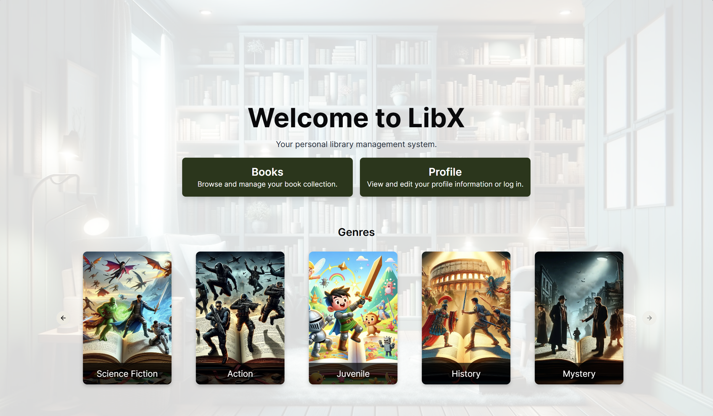
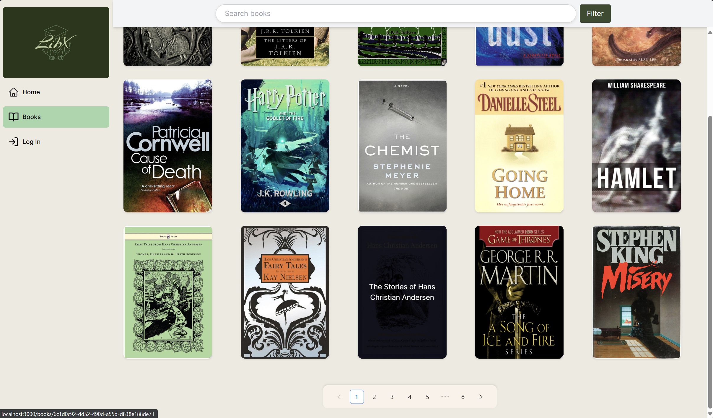
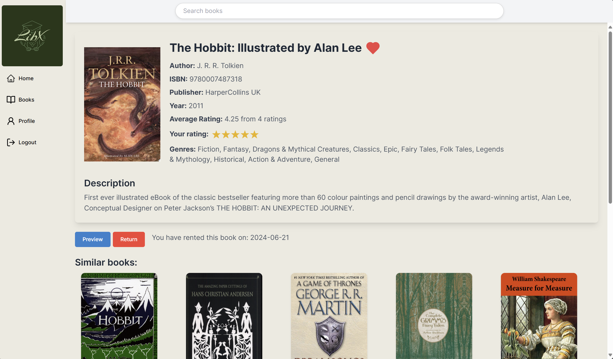

# LibX

## Overview
This project is a web application for library management where users receive personalized book recommendations based on similar descriptions (content-based filtering) or other similar users' preferences (collaborative filtering).
The Google Books API was used for getting the books' information and Firebase for storing the books' photos. 
The project contains 2 APIs : the main Spring API that manages the books and users and the secondary one made with fast API that is refreshing the recommendations when it is triggered by adding/modifying/deleting books.

## Screenshots
### Homepage

### Book catalog

### Book page

You can find more here: [Screenshots](screenshots)

